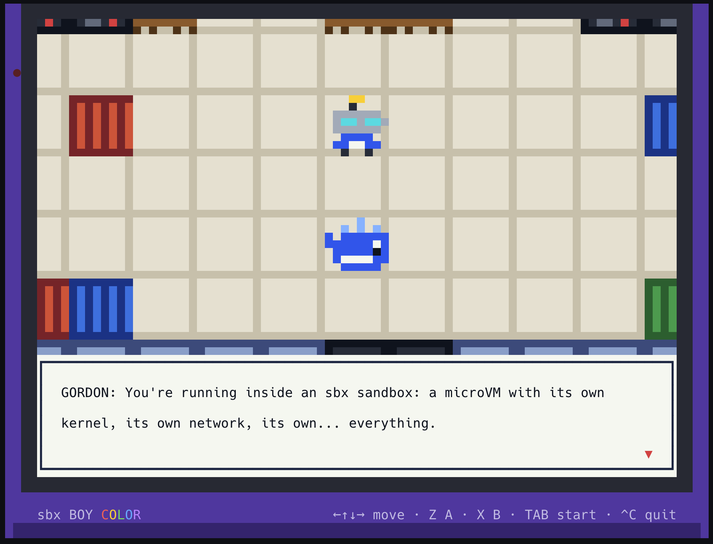

# MOBY: Escape the Sandbox

A Game Boy Color–style, Pokémon-like RPG for the terminal, built with [OpenTUI](https://opentui.com) on Node.js.

You play **Moby**, a whale who wakes up inside an [`sbx` sandbox](https://docs.docker.com/ai/sandboxes/) and wants out: past the node_modules of `/tmp`,
through `/proc` and the cgroups, all the way to the Hypervisor. You'll battle bugs and other software pests
(NULL POINTER, FORK BOMB, MEMORY LEAK, HEISENBUG, CVE-2026-1337...) and four bosses:
the **EGRESS PROXY**, **SECCOMP**, the **OOM KILLER**, and the **HYPERVISOR**.

Spoiler: you don't get out.



## Requirements

- **Node.js ≥ 26.4.** OpenTUI's Node runtime depends on `node:ffi`, which needs the `--experimental-ffi` flag. The launcher adds the flag for you.
- A true-color terminal that's at least **80×30** (**88×37** if you want the "sbx BOY COLOR" shell drawn around the screen).
  Ghostty, Kitty, WezTerm, iTerm2 and Alacritty all work well. Terminals that support the kitty keyboard protocol give smoother held-key movement.

## Run

```bash
npm install
npm start
```

### With Docker

No Node install needed. Just run it with a TTY (`-it`):

```bash
docker run --rm -it -v moby-escape:/data docker/moby-escape
```

To build the image yourself: `docker build -t moby-escape .` or for cross-platform: `docker buildx build --platform linux/amd64,linux/arm64 -t moby-escape .`

## Controls

| Key | Action |
| --- | --- |
| Arrows / WASD / HJKL | Move, navigate menus |
| Z / Enter / Space | A: talk, confirm, advance text |
| X / Esc / Backspace | B: back, cancel |
| Tab / M | START menu (stats, bag, save, quit) |
| Ctrl+C | Quit |

Your save is stored at `~/.moby-escape-save.json` (set `MOBY_SAVE` to change the path). Use SAVE from the START menu;
the game also saves automatically after each boss.

## Gameplay tips

- Walk through the tangled **node_modules** patches to find wild bugs and gain XP.
- Type matchups: **SEC** beats BUG · **KERNEL** beats NET and SEC · **NET** beats DATA · **DATA** beats KERNEL · **BUG** beats DATA.
- **RESTART STATIONS** heal you fully and become your respawn point.
- Trainers challenge you when they see you. Bosses let you back off ("NOT YET") so you can go train first.

## Project layout

```
bin/moby-escape.js   launcher (checks the Node version, adds --experimental-ffi)
src/main.js          OpenTUI renderer setup, input, frame loop
src/view.js          Game Boy Color–style shell around the 80x30 "LCD"
src/gfx.js           80x60 pixel buffer drawn with half-block characters, text layer, pixel fonts
src/engine.js        input, dialog, menus, tweens, fades, async scripting
src/overworld.js     tile maps, movement, NPCs, trainers, warps, START menu
src/battle.js        turn-based battle system and animations
src/data.js          types, moves, monsters, items, stat formulas
src/sprites.js       all the pixel art
src/story.js         maps, NPCs, bosses, intro, ending, title screen
src/state.js         game state and save/load
tools/snap.js        headless driver that renders PNG snapshots (for development)
tools/sim.js         balance simulator
tools/check-maps.js  map sanity and reachability checks
```
